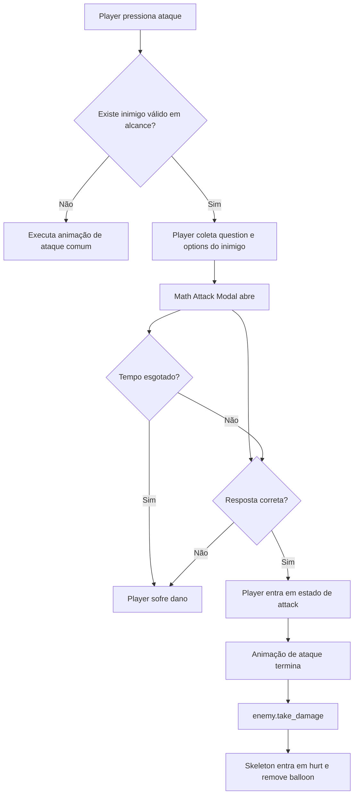
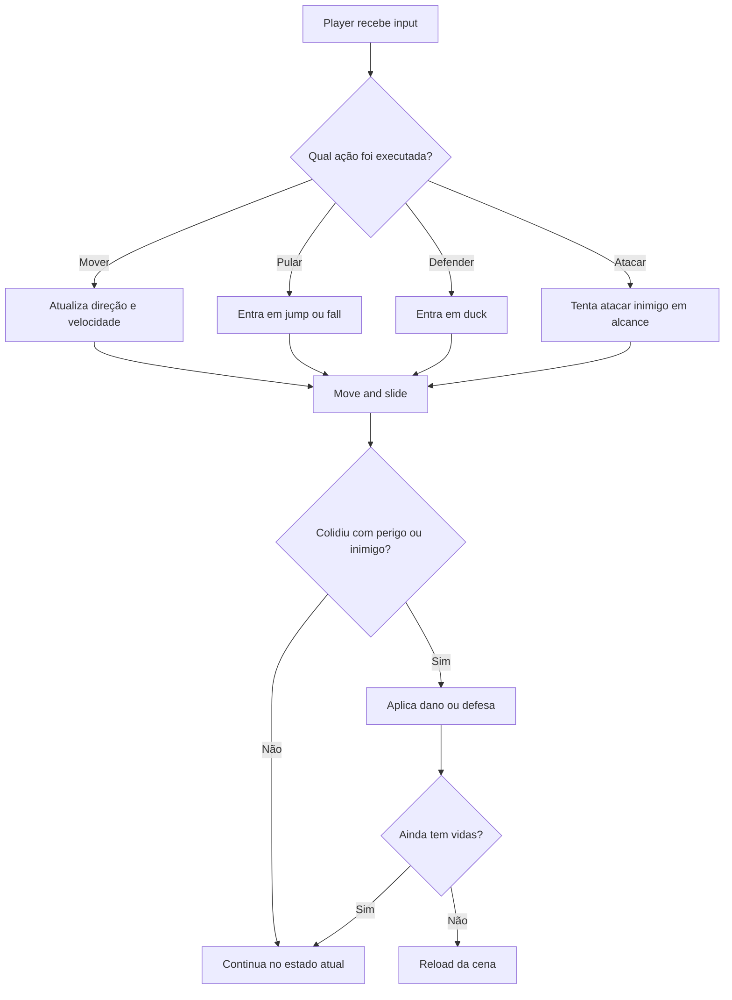
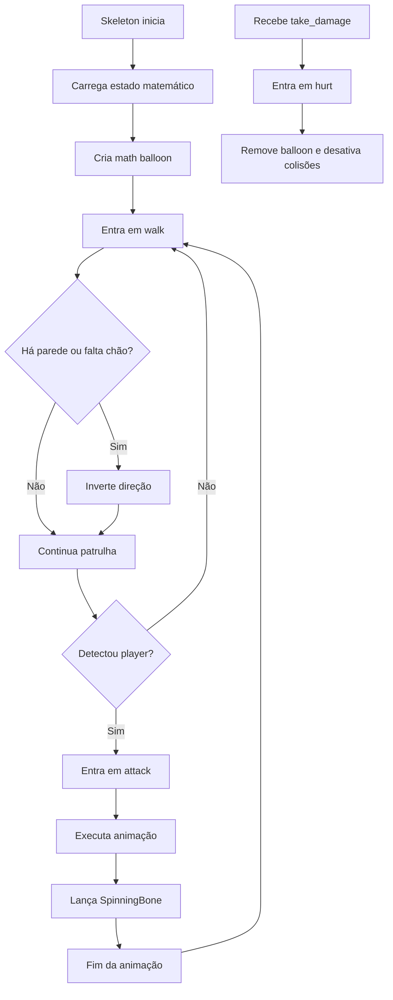

# Math Jump

## Descrição do Game

Math Jump é um jogo sério de matemática desenvolvido em Godot. A proposta mistura plataforma vertical com desafios matemáticos: o jogador sobe pelo cenário, enfrenta inimigos e progride ao interagir com sistemas de combate, defesa e resolução de cálculos.

## Objetivo do Game

O objetivo do jogo é transformar o aprendizado de matemática em uma experiência interativa. Durante a progressão, o jogador deve:

- subir pelas fases e plataformas do cenário
- enfrentar inimigos ao longo do percurso
- responder cálculos matemáticos para atacar corretamente
- sobreviver usando vidas, defesa e movimentação
- avançar até novos mapas, operações matemáticas e boss final

## Equipe Responsável

- Johnatan Vargas da Fonseca
- Iago Henrique Pinto Bogler
- Guilherme Franciel Meiring
- Marceu Lago Pontes Schmidt
- Cleberson Luis Vieira Martins Maia

## Como Baixar o Projeto

### Pré-requisitos

- Git instalado na máquina
- Godot 4.6 ou versão compatível com o projeto

### Clonando o repositório

```bash
git clone <URL_DO_REPOSITORIO>
cd math-jump
```

Substitua `<URL_DO_REPOSITORIO>` pela URL real do repositório no GitHub.

## Como Configurar e Rodar o Game

### Passo a passo pelo editor Godot

1. Abra a Godot Engine.
2. Clique em `Import`.
3. Selecione o arquivo `project.godot` na raiz do projeto.
4. Aguarde a importação dos arquivos.
5. Abra o projeto importado.
6. Rode o jogo pela cena principal configurada no projeto.

### Cena principal atual

- `scene/tropic.tscn`

### Execução por linha de comando

Se você tiver o executável da Godot configurado no sistema, também pode rodar com:

```bash
godot4 --path .
```

## Controles do Player

- `A` ou seta para a esquerda: mover para a esquerda
- `D` ou seta para a direita: mover para a direita
- `W` ou seta para cima: pular
- `S` ou seta para baixo: abaixar / defender
- `J` ou `Espaço`: atacar
- `I`: interagir
- `O`: avançar diálogo

## Mecânicas Atuais do Game

Atualmente o projeto já possui os seguintes sistemas jogáveis:

- movimentação lateral do player
- pulo e pulo duplo
- máquina de estados do player
- ataque corpo a corpo com validação por resposta matemática
- modal de ataque com tempo limite
- defesa contra projéteis quando o player está abaixado e virado para o lado correto
- sistema de vidas com exibição em corações
- dano por contato com inimigos
- dano por projétil
- dano por queda alta
- recuperação temporária após sofrer dano
- recarregamento da cena ao morrer
- inimigo `Skeleton` com patrulha, detecção do player, ataque e estado de dano
- projétil `SpinningBone`
- sistema de diálogo para placa/interação
- balão com expressão matemática acima dos inimigos
- geração de perguntas matemáticas com alternativas

## Sistema de Matemática

O fluxo matemático atual funciona assim:

- cada inimigo gera ou recupera uma pergunta matemática
- a operação do inimigo é configurável por `operation_type`
- quando o player tenta atacar um inimigo válido, o jogo abre um modal
- o modal exibe a pergunta, três alternativas e um tempo limite
- se o jogador acertar, o inimigo recebe dano
- se errar ou o tempo acabar, o player sofre dano

Operações já presentes no código:

- multiplicação
- divisão
- raiz
- potência
- fatorial

### Mini Diagrama do Fluxo de Ataque Matemático



Esse fluxo está distribuído principalmente entre:

- `scripts/player.gd`
- `scripts/math_attack_modal.gd`
- `scripts/skeleton.gd`
- `scripts/dialog_manager.gd`

## Mapas e Fases

### Cena principal jogável

- `scene/tropic.tscn`
  - fase atual usada como cena principal do projeto
  - possui player, câmera, cenário com parallax, inimigos `Skeleton` e placa de diálogo

## Fluxo dos Sistemas e Scripts

### Player

Arquivo principal: `scripts/player.gd`

Responsabilidades atuais:

- ler input de movimento, pulo, defesa, ataque e interação
- controlar estados como `idle`, `walk`, `jump`, `fall`, `duck`, `attack` e `hurt`
- aplicar dano, invulnerabilidade temporária e morte
- abrir o modal de ataque matemático ao atacar inimigos
- atualizar os corações de vida na interface

Fluxo resumido:

- recebe input
- muda de estado
- move o personagem
- detecta colisões e áreas perigosas
- tenta atacar inimigos em alcance
- valida a resposta matemática antes de aplicar dano no alvo

#### Diagrama do Fluxo do Player



### Enemy Skeleton

Arquivo principal: `scripts/skeleton.gd`

Responsabilidades atuais:

- patrulhar a plataforma
- inverter direção ao detectar parede ou falta de chão
- detectar o player
- entrar em estado de ataque
- lançar o projétil `SpinningBone`
- carregar uma pergunta matemática própria
- exibir um balão com a expressão do inimigo

Fluxo resumido:

- inicia em `walk`
- patrulha o cenário
- detecta o player com raycast
- entra em `attack`
- arremessa um osso
- volta a patrulhar
- ao receber dano, entra em `hurt`

#### Diagrama do Fluxo do Skeleton



### Spinning Bone

Arquivo principal: `scripts/spinning_bone.gd`

Responsabilidades atuais:

- mover o projétil horizontalmente
- respeitar a direção lançada pelo inimigo
- ser destruído por tempo, colisão com área ou colisão com corpo

Fluxo resumido:

- é instanciado pelo `Skeleton`
- recebe direção
- avança em linha reta
- desaparece ao colidir ou ao fim do timer

### Math Balloon

Arquivos principais:

- `scripts/math_balloon.gd`
- `scripts/math_question_box.gd`

Responsabilidades atuais:

- mostrar o cálculo associado ao inimigo
- acompanhar a posição do alvo
- remover o balão quando o alvo deixa de existir
- exibir texto com efeito progressivo de letras

Fluxo resumido:

- o `Skeleton` pede ao `DialogManager` para criar o balão
- o balão fica preso visualmente ao inimigo
- o texto da pergunta é exibido acima do alvo

### Math Attack Modal

Arquivo principal: `scripts/math_attack_modal.gd`

Responsabilidades atuais:

- abrir a interface de resposta do ataque matemático
- pausar temporariamente a árvore do jogo
- exibir alternativas
- controlar navegação por teclado
- controlar o tempo da resposta
- devolver resultado de acerto, erro ou tempo esgotado

Fluxo resumido:

- o player tenta atacar
- o modal abre com pergunta e opções
- o jogador escolhe uma resposta
- o modal informa o resultado ao player
- o jogo retoma a execução normal

### Dialog Manager

Arquivo principal: `scripts/dialog_manager.gd`

Responsabilidades atuais:

- controlar mensagens de diálogo em sequência
- criar caixas de texto na interface
- criar balões matemáticos para inimigos
- persistir o estado das perguntas por inimigo durante a cena

Fluxo resumido:

- recebe pedido de diálogo ou balão
- instancia a caixa de texto
- controla avanço de mensagem
- armazena estado matemático por identificador do inimigo

### Warning Sign

Arquivo principal: `scripts/warning_sign.gd`

Responsabilidades atuais:

- detectar quando o player pode interagir
- mostrar indicador visual de interação
- iniciar o diálogo da placa

### Camera

Arquivo principal: `scripts/camera.gd`

Responsabilidades atuais:

- localizar o player pelo grupo `player`
- seguir continuamente a posição do personagem

### Math System

Arquivo principal: `scripts/math_system.gd`

Responsabilidades atuais:

- gerar perguntas matemáticas
- calcular a resposta correta
- gerar alternativas erradas válidas

## Estrutura Básica do Projeto

```text
math-jump/
|- entities/     # cenas reutilizáveis do jogo
|- scene/        # mapas e fases
|- scripts/      # scripts principais em GDScript
|- singletons/   # arquivos auxiliares
|- sprites/      # artes, UI e efeitos
|- tiles/        # tilesets e terreno
|- project.godot # configuração do projeto
```

## Licença

Este projeto está licenciado sob a MIT License.
