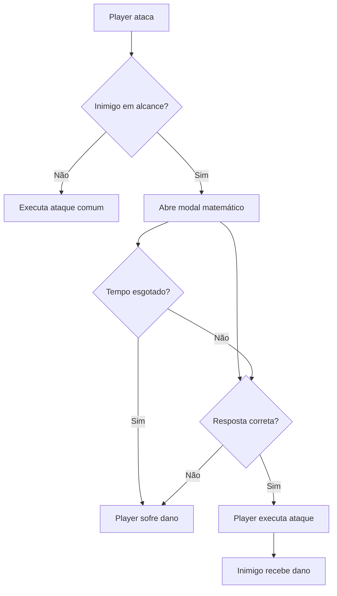

# Math Jump

Math Jump é um jogo sério de matemática desenvolvido em Godot 4. O jogo combina plataforma vertical, combate e desafios matemáticos: Diego sobe por biomas de Numeralia, enfrenta inimigos e restaura o equilíbrio resolvendo cálculos.

## História

Em Numeralia, a matemática mantém tudo funcionando. Plataformas, caminhos, criaturas e biomas obedecem a fórmulas que precisam estar corretas para o mundo permanecer em equilíbrio.

Um erro misterioso alterou essas fórmulas. Com isso, os biomas entraram em desequilíbrio, inimigos apareceram pelo caminho e a subida de Diego foi bloqueada por desafios matemáticos.

Diego é um estudante que ainda não confia totalmente nas próprias respostas, mas descobre que pode transformar acertos em energia para avançar e derrotar inimigos. Durante a jornada, ele aprende que errar, tentar de novo e entender o raciocínio também fazem parte do aprendizado.

Ao restaurar os biomas, Diego prova que evoluiu na matemática e devolve o equilíbrio a Numeralia.

## Fases

### Vale Tropical

A fase apresenta os principais sistemas do jogo e foca em desafios de multiplicação e divisão, com dificuldade mais acessível.

Personagem guia: Holly.

Cena: `scene/tropic.tscn`

### Picos de Gelo

A fase aumenta a dificuldade com desafios de raiz, potência e fatorial, exigindo mais atenção do jogador antes de responder.

Personagem guia: Penguin.

Cena: `scene/ice.tscn`

## Objetivo

O objetivo é restaurar o equilíbrio dos biomas de Numeralia. Para concluir uma fase, o jogador precisa derrotar todos os inimigos e conversar com o personagem final do mapa.

Fluxo geral:

1. Escolher um mapa no menu principal.
2. Subir pela fase vertical.
3. Enfrentar inimigos pelo caminho.
4. Resolver perguntas matemáticas para atacar.
5. Derrotar todos os inimigos.
6. Falar com o personagem final para concluir a fase.

## Controles

- `A` ou seta esquerda: mover para a esquerda
- `D` ou seta direita: mover para a direita
- `W` ou seta cima: pular
- `W` ou seta cima no ar: pulo duplo
- `S` ou seta baixo: abaixar / defender
- `Espaço`: atacar
- `I`: interagir com personagens
- `O`: avançar diálogo

## Mecânicas

- Plataforma vertical com câmera seguindo o player.
- Movimento lateral, pulo e pulo duplo.
- Sistema de vidas com corações.
- Dano por projéteis.
- Dano por queda.
- Defesa contra projéteis ao abaixar virado para a direção correta.
- Ataque corpo a corpo com validação matemática.
- Modal de resposta com alternativas e tempo limite.
- Inimigos com patrulha, detecção do player, ataque e estado de dano.
- Balões matemáticos acima dos inimigos.
- Diálogos de história com personagens interativos.
- Bloqueio de conclusão de fase enquanto houver inimigos vivos.
- Transição entre fases por diálogo final.
- Menu principal com escolha entre `Vale Tropical` e `Picos de Gelo`.

## Sistema De Matemática

Cada inimigo possui um `operation_type`, que define o tipo de cálculo gerado pelo `MathSystem`.

Operações disponíveis:

- `mult`: multiplicação
- `div`: divisão
- `sqrt`: raiz quadrada
- `pow`: potência
- `fact`: fatorial

Fluxo do ataque matemático:

1. O player tenta atacar.
2. Se houver inimigo válido no alcance, o modal matemático abre.
3. O modal mostra a pergunta, três alternativas e um limite de tempo.
4. Se o jogador acertar, Diego executa o ataque e o inimigo sofre o dano.
5. Se errar ou o tempo acabar, Diego sofre dano.



## Arquitetura

### Player

Arquivo principal: `scripts/player.gd`

Responsabilidades:

- Ler inputs de movimento, pulo, defesa e ataque.
- Controlar estados como `idle`, `walk`, `jump`, `fall`, `duck`, `attack` e `hurt`.
- Controlar vidas, dano, recuperação e morte.
- Detectar inimigos em alcance.
- Abrir o modal de ataque matemático.
- Aplicar dano ao inimigo após resposta correta.

### Skeleton

Arquivo principal: `scripts/skeleton.gd`

Responsabilidades:

- Patrulhar plataformas.
- Inverter direção ao detectar parede ou falta de chão.
- Detectar o player.
- Atacar com `SpinningBone`.
- Gerar e manter a pergunta matemática do inimigo.
- Exibir o balão com a expressão matemática.
- Entrar em estado `hurt` ao ser derrotado.

### SpinningBone

Arquivo principal: `scripts/spinning_bone.gd`

Responsabilidades:

- Mover o projétil na direção definida pelo inimigo.
- Causar perigo ao player pelo grupo `lethalArea`.
- Desaparecer por colisão ou fim do timer.

### MathSystem

Arquivo principal: `scripts/math_system.gd`

Responsabilidades:

- Gerar perguntas matemáticas.
- Calcular a resposta correta.
- Criar alternativas erradas válidas.

### MathAttackModal

Arquivo principal: `scripts/math_attack_modal.gd`

Responsabilidades:

- Pausar temporariamente o jogo durante a resposta.
- Exibir pergunta, alternativas e timer.
- Permitir navegação por teclado.
- Emitir o resultado da resposta.

### DialogManager

Arquivo principal: `scripts/dialog_manager.gd`

Responsabilidades:

- Controlar mensagens de diálogo em sequência.
- Criar caixas de texto.
- Criar balões matemáticos vinculados aos inimigos.
- Persistir perguntas dos inimigos durante a cena.
- Emitir sinal quando uma conversa termina.

### Personagens Interativos

Arquivos principais:

- `scripts/holly.gd`
- `scripts/penguin.gd`

Responsabilidades:

- Detectar interação com o player.
- Mostrar indicador de interação.
- Iniciar diálogos de história.
- Impedir conversa final enquanto existirem inimigos vivos.
- Trocar de cena após a conversa final quando `next_scene_path` estiver configurado.

### Camera

Arquivo principal: `scripts/camera.gd`

Responsabilidades:

- Localizar o player pelo grupo `player`.
- Seguir continuamente a posição do player.

### Main Menu

Arquivo principal: `scripts/main_menu.gd`

Responsabilidades:

- Exibir o menu inicial.
- Mostrar preview do jogo.
- Abrir o seletor de mapas.
- Iniciar `Vale Tropical` ou `Picos de Gelo`.

## Estrutura Do Projeto

```text
math-jump/
|- entities/     # entidades, como player, inimigos, UI e personagens
|- scene/        # cenas e tela principal
|- scripts/      # scripts GDScript
|- sprites/      # assets visuais, fontes e UI
|- tiles/        # tilesets do projeto
|- project.godot # configuração principal da Godot
```

## Como Rodar

### Requisitos

- Godot 4.6 ou versão compatível
